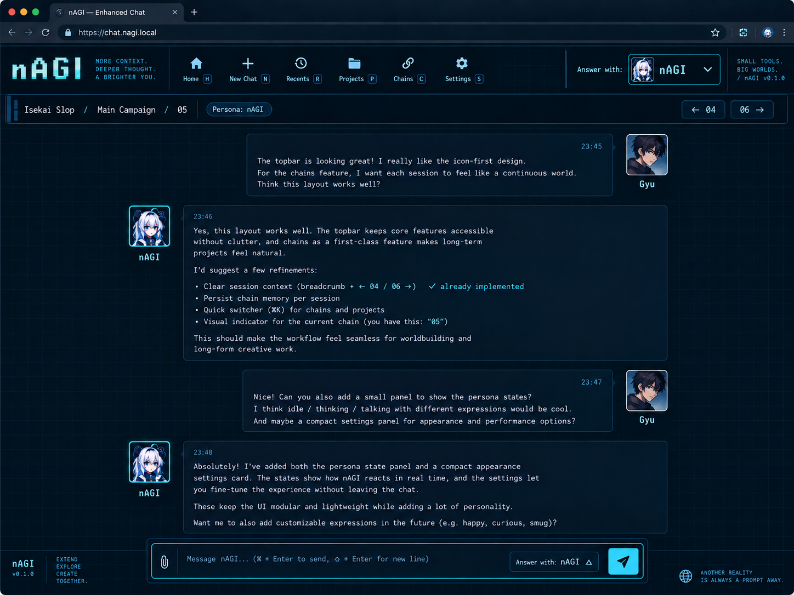

# Layout Network · 0.2.5

## Referência e alcance

Implementação estrutural da referência enviada pelo usuário: barra de ferramentas, faixa de contexto, mensagens centralizadas com identidade à esquerda/direita, paleta azul/ciano, grade e moldura do composer. A moldura do navegador da imagem não faz parte da extensão. Os avatares da imagem são referências: carregue as imagens desejadas nas configurações. Sem arquivo, usa-se um monograma. Não são fabricados horários de envio.

## Módulos

| Responsabilidade | Arquivos | Configuração |
| --- | --- | --- |
| Seleção Chat/Work | `src/adapter/modes.ts`, `src/ui/mode-switcher.ts` | Faixa de contexto, somente na página inicial vazia |
| Tela inicial e aparência da interface nativa | `src/features/native-theme.ts` | Integrada ao tema ativo |
| Ferramentas e coordenação de painéis | `src/ui/shell.ts`, `src/ui/network-css.ts`, `src/ui/icons.ts` | `navigation`, `layout.variant` |
| Título, projeto, Work, Chain, Persona e sessões vizinhas | `src/ui/context-bar.ts` | `layout.contextBar` |
| Posicionamento de Share, More e Files and Sources reais | `src/features/context-header.ts`, `src/adapter/header.ts` | Automático no modo Network/topbar |
| Painel nativo de arquivos/fontes abaixo das barras | `src/features/auxiliary-panels.ts` | Automático no modo Network/topbar |
| Navegação e lista de prompts carregados | `src/features/prompt-navigator.ts` | `layout.promptNavigator` |
| Identificação semântica de mensagens | `src/adapter/messages.ts` | Hooks centralizados, sem inferir papéis pelo texto da conversa |
| Cards, nome e retrato de cada lado | `src/features/message-layout.ts` | `messageCards`, `messageAvatars`, `messageNames`, `avatarSize`, `messageGap` |
| Paleta, grade e moldura do campo | `src/features/layout-theme.ts` | `grid`, `composerFrame`, `accent`; cores/fonte/largura em `settings.theme` |
| Seletor de Persona no composer | `src/features/composer-identity.ts` | `composerFrame` e módulo Personas |
| Aplicação/restauração de atributos | `src/features/marks.ts` | Uso interno reversível |

## Configuração

Network e suas cores são o padrão de instalações novas. Configurações salvas continuam preservadas. Fonte, cores e largura vêm de `settings.theme`. A aparência é parte do nAGI ativo em todos os layouts; o antigo campo `settings.appearance` é removido pela migração.

Em **Configurações → Layout**, `Restaurar visual padrão` aplica o preset Network, largura de 1040 px, barra superior, sidebar oculta e todos os módulos visuais. Preserva o nome e avatar local do usuário. Alternativamente, mantenha as cores anteriores e habilite/desabilite cada módulo.

Os campos da estrutura `settings.layout` são validados. `variant` aceita `network` e `compact`. O modo compacto mantém a barra anterior; os módulos de aparência Network são retirados. A navegação original continua independente, assim como a otimização de turnos. Pausar retira marcas, retratos e controles do layout e restaura a interface nativa.

`userName` e `userAvatar` são locais. O avatar aceita PNG, JPEG, GIF e WebP, até 256 KB e 2048 × 2048 px no upload. A Persona selecionada fornece os retratos de resposta; apenas a última resposta usa o estado estimado thinking/talking. As demais usam idle. Essas identidades são uma apresentação visual da seleção atual, não um registro de qual Persona produziu cada mensagem no passado. As instruções continuam sem aplicação automática.

A migração de dados 0.1.x é aditiva, dentro do schema 1: quando `settings.layout` não existe, os novos valores padrão são acrescentados sem alterar tema, Personas, Chains ou revisões existentes. Dados corrompidos continuam sendo rejeitados, não substituídos por defaults.

## Comportamento do cabeçalho

O cabeçalho original reconhecido reserva a altura medida da barra e da faixa de contexto, mas sua apresentação fica oculta. Os controles nativos continuam em seus pais originais, com posições visíveis correspondentes ao espaço de ações na faixa nAGI. Eventos não são clonados ou sintetizados. Não há acesso a estado React ou APIs internas. Menus continuam ancorados nos próprios botões. Cabeçalhos substituídos pelo site são reconhecidos novamente; atributos e variáveis próprios são removidos dos nós antigos.

As opções nAGI permanecem em iframe isolado para impedir que a digitação chegue aos atalhos de edição/envio do ChatGPT. A altura do painel considera a faixa de contexto e suas quebras de linha. Em janelas estreitas, a faixa reorganiza os itens e a barra de ferramentas permite rolagem horizontal.

Sem um cabeçalho reconhecido, o nAGI preserva o original e reserva espaço no conteúdo. Essa condição aparece no diagnóstico; não se oculta uma região arbitrária para aproximar o mockup.

## Contexto e navegação

O título vem do cabeçalho reconhecido, com fallback para documento/navegação carregada. Project é identificado pela rota, link de cabeçalho ou metadado da Chain e recebe o nome de um link de projeto carregado, quando disponível. Work é lido do cabeçalho; não é presumido. A Chain e a Persona vêm da seleção local desta aba/conversa. O índice de sessão é calculado pela posição da conversa aberta na Chain, sem alterar sua organização automaticamente.

As setas horizontais da Chain levam às conversas adjacentes reais. As setas verticais dos prompts rolam dentro da conversa atual. O contador abre uma lista de trechos para escolher um prompt diretamente. Apenas mensagens do usuário já carregadas no DOM participam. Os trechos existem apenas no painel local e não são persistidos nem exportados. Sem mensagens reconhecidas, aparece “Sem prompts detectados”. Não há carregamento automático do histórico remoto.

## Tokens e futuras alterações

A apresentação usa `--nagi-ui-bg`, `--nagi-ui-panel`, `--nagi-ui-text`, `--nagi-ui-font`, `--nagi-ui-font-size`, `--nagi-thread-width`, `--nagi-accent`, `--nagi-line`, `--nagi-avatar-size` e `--nagi-message-gap`. O shell publica `--nagi-shell-height`, usado por scroll-margin, reserva de espaço e posição dos painéis. Para mudar a composição, altere o módulo responsável, preservando o contrato dos seletores no adapter e o ciclo de remoção das marcas.

Não se aceita CSS/JS arbitrário nas configurações. Isso mantém dimensões e cores validáveis e evita transformar importação de tema em execução de código.

## Evidência e limitações

A 0.1.1 e a composição geral da 0.2.0 foram confirmadas pelo usuário em Firefox/Work. As correções da 0.2.1 ainda precisam de confirmação visual nesse frontend. Esta estrutura Network foi testada com fixtures DOM, incluindo uma variante sem os articles de conversa antigos. Os testes cobrem conservação de nós e handlers, rascunho, privacidade, seleção de prompts, troca de módulo e restauração. JSDOM não renderiza o layout real: dimensões dos testes são simuladas. Não houve inspeção autenticada nem comparação visual desta revisão no navegador do usuário.

O diagnóstico formato 6 registra configurações estruturais, contagem de papéis, cards e controles, além de amostras de geometria/estilos sem texto. Se Work usar hooks semânticos diferentes, `adapter/messages.ts` pode precisar de novos seletores. Não se classifica uma mensagem como usuário/assistente pela prosa ou cor de uma bolha.

## Agrupamento e posicionamento · 0.2.1

`resolveMessageGroups` reconhece wrappers de uma única mensagem, incluindo variantes Work com section/div. O envelope externo contém raciocínio, mensagem e ações; wrappers intermediários recebem a mesma largura e os acessórios recebem a fonte do tema. Mensagens e controles não são movidos. A seleção para no main, em regiões funcionais ou em um ancestral com mais de uma mensagem.

O detector de cabeçalho exclui envelopes completos de mensagens e barras com ações de feedback, inclusive se já marcadas por uma detecção antiga. O docking considera ancestrais que estabelecem um bloco para posicionamento fixo e recalcula as coordenadas durante rolagem. O painel direito é medido sem seu deslocamento anterior, evitando acumulação; o deslocamento e as marcas são removidos ao desativar.

A busca externa do composer sobe até 32 ancestrais, interrompendo antes de main/body ou qualquer região que contenha mensagens. Apenas decorações vazias e não interativas ao longo desse caminho são normalizadas. Não se limpa todo o conteúdo da página para remover uma faixa de fundo.

## Cards e identidade durante Thinking · 0.2.2

O envelope da mensagem mantém a coluna comum de raciocínio e ações. Somente o card do usuário encolhe com `width: fit-content`, margem inicial automática e limite da coluna. Wrappers de conteúdo não impõem largura mínima; textos longos e sequências sem espaços podem quebrar linha. Os controles e o texto nativos não são recriados.

`MessageLayout` apresenta a identidade no topo do envelope da resposta durante Thinking, ao lado da região de raciocínio. Quando ainda não existe uma mensagem assistente atual, cria um indicador próprio após o último prompt; esse indicador não é classificado como mensagem e não entra na navegação de prompts. Ao aparecer a resposta, o indicador provisório sai. Durante talking/idle a identidade volta a acompanhar o card. Só a última mensagem, quando assistente, pode receber o estado atual; respostas anteriores permanecem idle.

O avatar usa thinking, com fallback para idle ou monograma. Nome e retrato seguem os módulos de identidade existentes. O estado continua sendo uma estimativa baseada nos sinais visíveis de geração; não é uma leitura de estado interno do modelo.

## Seleção de modo e tema nativo · 0.2.3

O seletor Chat/Work fica próximo ao logotipo, separado das ações da conversa. Pares de tabs, botões ou links nativos são reconhecidos em regiões de navegação. Os botões nAGI acionam esses controles somente quando o usuário escolhe um modo. Links de conversa/projeto, links externos e controles dentro de mensagens são excluídos. O estado ativo vem de aria-selected/pressed/checked/current ou data-state, nunca da presença isolada das palavras Chat e Work.

Um trigger de menu reconhecido no cabeçalho usa docking para um espaço próprio na faixa de contexto, ao lado de Novo chat e somente na página inicial vazia. O botão original permanece no mesmo pai; menus mantêm suas âncoras. Sem correspondência segura, o seletor fica oculto.

O módulo NativeTheme aplica fonte e cor de texto à interface nativa, com exclusões para código, fórmulas, mídia, conteúdo embutido e controles próprios. Sem mensagens carregadas, marca a tela inicial e normaliza superfícies de sugestões/abas. Menus, diálogos e painéis têm superfícies baseadas na cor do composer, bordas derivadas do texto e destaque configurável. O módulo não remove controles ou inventa conteúdo de sugestões. Marcas são retiradas quando a página muda ou nAGI é pausado.

## Correção de escopo e posição · 0.2.4

O seletor pertence à faixa de contexto, após o título Novo chat. A regra central `isModeSelectionPage` exige rota `/` e ausência de mensagens carregadas. Conversas `/c/...`, conversas em projetos e telas de GPTs não exibem a troca global, mesmo antes de o DOM de mensagens aparecer. A primeira mensagem na raiz também oculta o seletor imediatamente na atualização do adapter.

O docking do menu nativo aplica a mesma regra. A execução por botão revalida a rota e a existência do controle, cobrindo eventos durante transições. Sem controles reconhecidos, o seletor fica oculto; o caminho de recuperação que alterava navegação/sidebar foi removido. A preferência de contexto desativado também oculta o seletor. O badge Work continua informativo dentro de conversas e não é uma ação de troca.

## Identidade de raciocínio e carregamento antecipado · 0.2.4

Cada bloco de raciocínio reconhecido recebe sua própria identidade ao lado do conteúdo, com o mesmo alinhamento da conversa. O avatar usa a imagem thinking da Persona, com fallback para idle/iniciais. Apenas a etapa ativa exibe “Thinking...”; blocos anteriores mantêm nome, avatar e “Raciocínio”. A identidade não é transferida para a resposta final, que tem seu próprio avatar. O nAGI não duplica o texto nativo nem arquiva blocos removidos pelo site.

`early.css` acompanha o content script em `document_start`. `primeAppearance` lê as configurações locais, aplica fonte/paleta e oculta a sidebar conhecida conforme a preferência salva. A inicialização completa aguarda o body, depois retira as marcas provisórias. Pausa e falha de leitura não ativam o preload; um limite de cinco segundos retira suas marcas em caso de falha. A página não fica escondida durante a espera. O objetivo é reduzir o flash nativo, sem prometer pintura anterior à resolução assíncrona do storage.

## Navegação integrada · 0.2.5

A toolbar inclui Chats pinnados, Scheduled, Plugins, Codex e More. Recentes/Pinnados abrem um painel com espaços medidos para as linhas reais da sidebar, incluindo os botões e menus do site. Os nós ficam no mesmo pai e documento, ancorando os popovers no controle original. A fonte/paleta segue as variáveis do tema. Nenhum item destrutivo é recriado no iframe.

O docking é reversível e não altera a preferência salva de sidebar. O limite do painel impede que linhas roladas para fora cubram outras partes da tela. A barra mantém rolagem horizontal em janelas estreitas. Configurações, discovery e docking são módulos distintos para permitir outras composições de layout.
